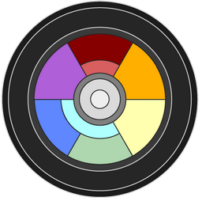
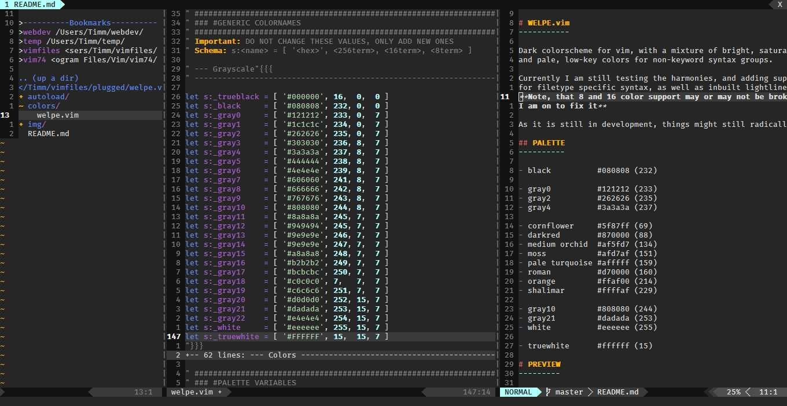
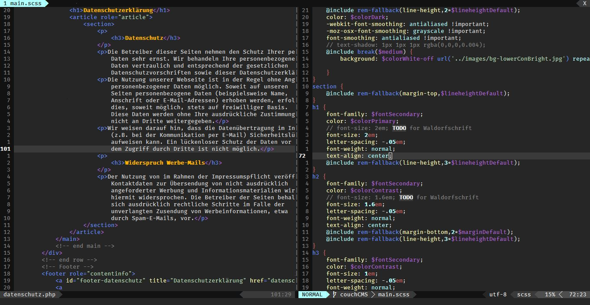

# WELPE.vim 
-----------

Dark colorscheme for vim, with a mixture of bright, saturated highlights
and pale, low-key colors for non-keyword syntax groups.

### INSTALLATION
----------------

###### via vundle

`Plugin 'tstelzer/welpe.vim'`

`:PluginInstall`

###### via vimplug

`Plug 'tstelzer/welpe.vim'`

`:PlugInstall`

###### manual download

- place [welpe.vim/master/colors/welpe.vim](https://raw.githubusercontent.com/tstelzer/welpe.vim/master/colors/welpe.vim) in `~/<yourvimdir>/colors/`
- if you want lightline support, place [welpe.vim/master/autoload/lightline/colorscheme/welpe.vim](https://raw.githubusercontent.com/tstelzer/welpe.vim/master/autoload/lightline/colorscheme/welpe.vim) in `~/<yourvimdir>/autoload/`

###### enable colorscheme

add the following line *after* `:syntax on`

`colorscheme welpe`

###### using lightline?

find your lightline settings and add `'colorscheme': 'welpe',` to the top, like:

```
let g:lightline = {
    \ 'colorscheme': 'welpe',
    // more lightline settings
```

### PALETTE
-----------

 `black #080808 (232)`

 `gray0 #121212 (233)`

 `gray2 #262626 (235)`

 `gray4 #3a3a3a (237)`

 `cornflower #5f87ff (69)`

 `darkred #870000 (88)`

 `medium orchid #af5fd7 (134)`

 `moss #afd7af (151)`

 `pale turquoise #afffff (159)`

 `roman #d75f5f (160)`

 `orange #ffaf00 (214)`

 `shalimar #ffffaf (229)`

 `gray10 #808080 (244)`

 `gray21 #dadada (253)`

 `white #eeeeee (255)`

 `truewhite #ffffff (15)`

### PREVIEW
-----------




### KNOWN 'BUGS'

1. 8 and 16 terminal colors might not work for now
2. vim / fugitive diff unreadable

### TODO
--------

###### plugin

- [X] Lightline
- [ ] better NERDtree colors
- [ ] readable diff colors (native + fugitive)

###### shortterm

- [ ] HTML
- [ ] CSS / SASS
- [ ] JS

###### longterm
*as I'm not coding in these, might take a while ...*

- [ ] C-family
- [ ] Python
