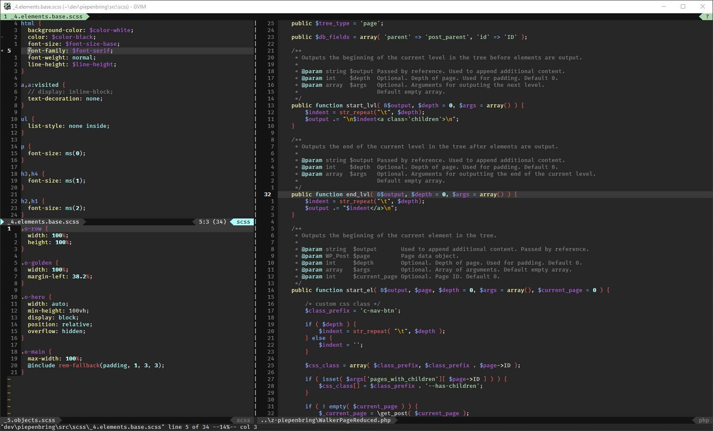
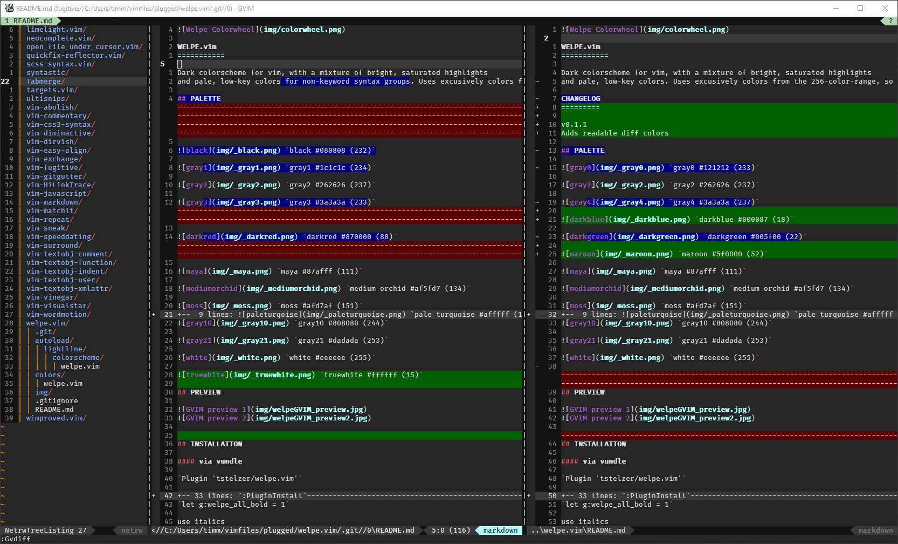

WELPE.vim 
===========

Dark colorscheme for vim, with a mixture of bright, saturated highlights
and pale, low-key colors. Uses exclusively colors from the 256-color-range, so it should look identical in gvim and vim.

CHANGELOG
---------

v0.1.2  Adds consistent colors for dirvish, syntastic, incsearch
        Various cleanups, some miniscule changes
v0.1.1  Adds readable diff colors

## PALETTE

 `gray0 #121212 (233)`

 `gray2 #262626 (237)`

 `gray4 #3a3a3a (237)`

 `darkblue #000087 (18)`

 `darkgreen #005f00 (22)`

 `maroon #5f0000 (52)`

 `maya #87afff (111)`

 `medium orchid #af5fd7 (134)`

 `moss #afd7af (151)`

 `pale turquoise #afffff (159)`

 `roman #d75f5f (160)`

 `orange #ffaf00 (214)`

 `shalimar #ffffaf (229)`

 `gray10 #808080 (244)`

 `gray21 #dadada (253)`

 `white #eeeeee (255)`

## PREVIEW




## INSTALLATION

#### via vundle

`Plugin 'tstelzer/welpe.vim'`

`:PluginInstall`

#### via vimplug

`Plug 'tstelzer/welpe.vim'`

`:PlugInstall`

#### manual download

- place [tstelzer/welpe.vim/master/colors/welpe.vim](https://raw.githubusercontent.com/tstelzer/welpe.vim/master/colors/welpe.vim) in `~/<yourvimdir>/colors/`
- if you want lightline support, place [tstelzer/welpe.vim/master/autoload/lightline/colorscheme/welpe.vim](https://raw.githubusercontent.com/tstelzer/welpe.vim/master/autoload/lightline/colorscheme/welpe.vim) in `~/<yourvimdir>/autoload/`

#### enable colorscheme

add the following line *after* `:syntax enable`

`colorscheme welpe`

#### using lightline?

find your lightline settings and add `'colorscheme': 'welpe',` to the top, like:

```
let g:lightline = {
    \ 'colorscheme': 'welpe',
    // more lightline settings
```

#### additional options

all-bold

`let g:welpe_all_bold = 1`

use italics

`let g:welpe_use_italics = 1`

## KNOWN PROBLEMS

- Diffs are still a bit iffy, mostly due to my own restriction to the 256-color-range; 
might use a wider range in the future
- Tried to make it work with ConEmu (windows), but the hassle is not worth the mediocre result

## TESTED PLUGINS
*other plugins might very well still work, depending on what highlight groups
they are using; the listed are simply the ones that I have tested and / or
modified*

- [x] [Lightline](https://github.com/itchyny/lightline.vim)
see screenshots for reference, if your setup doesnt work, feel free to open an issue

- [x] [GitGutter](https://github.com/airblade/vim-gitgutter)

- [x] Diffs: finally readable, see screenshots

- [x] [vim-sneak](https://github.com/justinmk/vim-sneak) colors consistent with
  search, specifically streak-mode and overlay colors

- [x] [incsearch](https://github.com/haya14busa/incsearch.vim) colors consistent
  with search

- [x] [syntastic](https://github.com/scrooloose/syntastic) made the inline-error
messages less obnoxious

- [x] [dirvish](https://github.com/justinmk/vim-dirvish) 

- [  ] [ctrlp](https://github.com/ctrlpvim/ctrlp.vim) would still prefer more
  color, to differenciate folder, file and filetype

## TESTED FILETYPES
*other filetypes might very well still work, depending on what highlight groups
they are using; the listed are simply the ones that I have tested and / or
modified*

- [x] HTML
- [x] PHP
- [x] CSS / SCSS (any problems here are mostly coming from runtimefiles, not highlighting)
- [ ] JS (works, but currently not coding enough to properly judge the quality )
