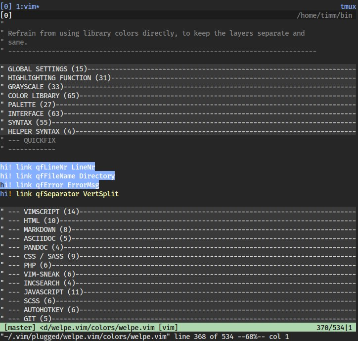
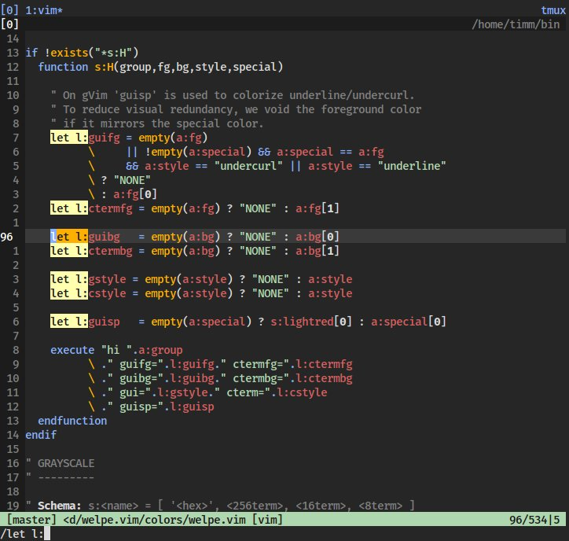

# WELPE.vim

Dark color scheme for [vim](https://www.vim.org).

## PALETTE

 `gray1 #121212 (234)`

 `gray2 #262626 (237)`

 `gray4 #262626 (237)`

 `darkblue #000087 (18)`

 `darkgreen #005f00 (22)`

 `maroon #5f0000 (52)`

 `maya #87afff (111)`

 `palepink #ff87af (211)`

 `moss #afd7af (151)`

 `paleturquoise #afffff (159)`

 `roman #d75f5f (160)`

 `orange #ffaf00 (214)`

 `shalimar #ffffaf (229)`

 `neutral #808080 (244)`

 `gray20 #d0d0d0 (252)`

 `truewhite #ffffff (15)`

## PREVIEW

    OS: Ubuntu
    WM: i3wm
    Terminal: Alacritty, tmux + zsh (xterm-256color)

Config: [github.com/tstelzer/dotfiles](https://github.com/tstelzer/dotfiles/blob/master/.vim/vimrc)

* visual mode, with folds

* searching, with `incsearch` and `hlsearch`

## INSTALLATION

#### via vundle

`Plugin 'tstelzer/welpe.vim'`

`:PluginInstall`

#### via vimplug

`Plug 'tstelzer/welpe.vim'`

`:PlugInstall`

#### manual download

- place [tstelzer/welpe.vim/master/colors/welpe.vim](https://raw.githubusercontent.com/tstelzer/welpe.vim/master/colors/welpe.vim) in `~/<yourvimdir>/colors/`

#### enable colorscheme

add the following line *after* `:syntax enable`

`colorscheme welpe`

## NEXT UP

* fixing python and pandoc
* everything error/warning
