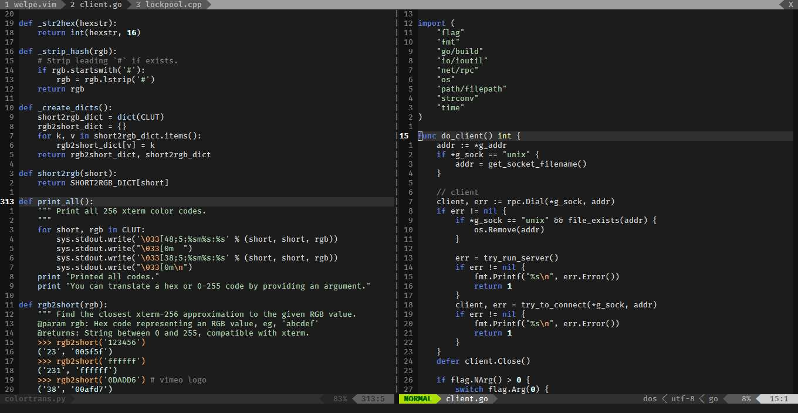

</img>

# welpe.vim 

##vim colorscheme loosely based on jellybeans and solarized dark

- Same colors in gvim & 256term
- works *allegedly* in 16term and 8term 
- filetype specific syntax for now very limited
- closeterm goals: better webdev-file-related colors

