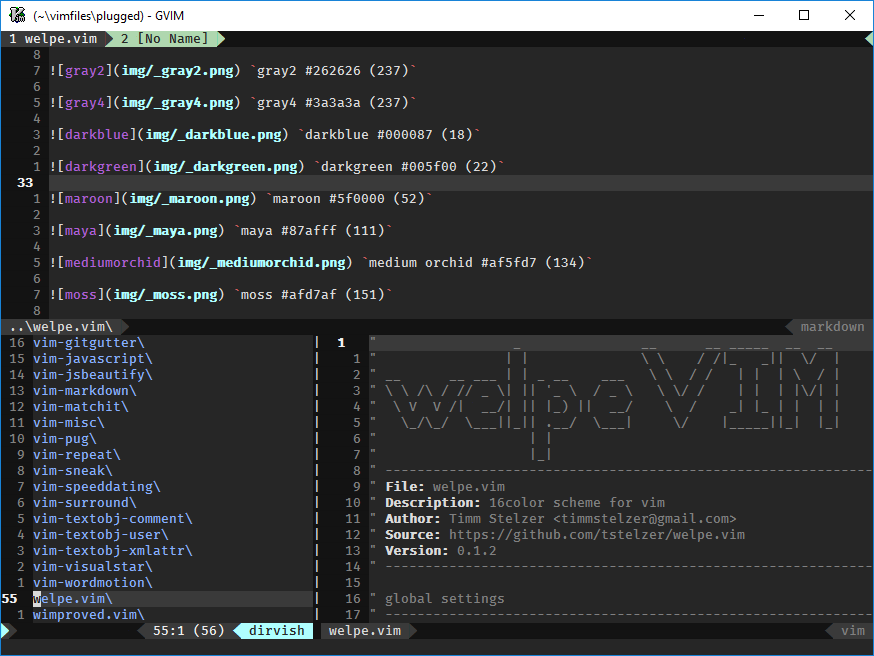
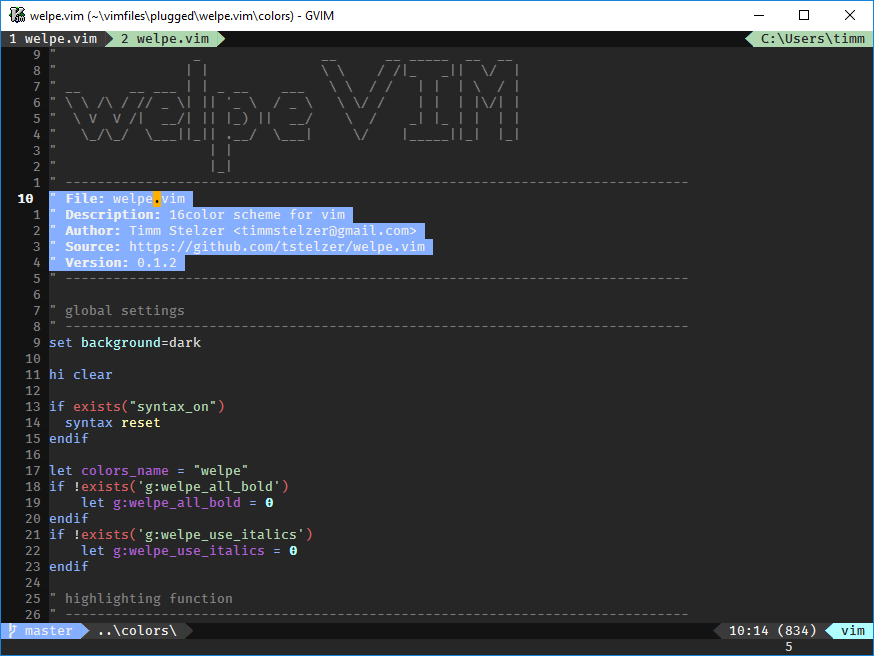
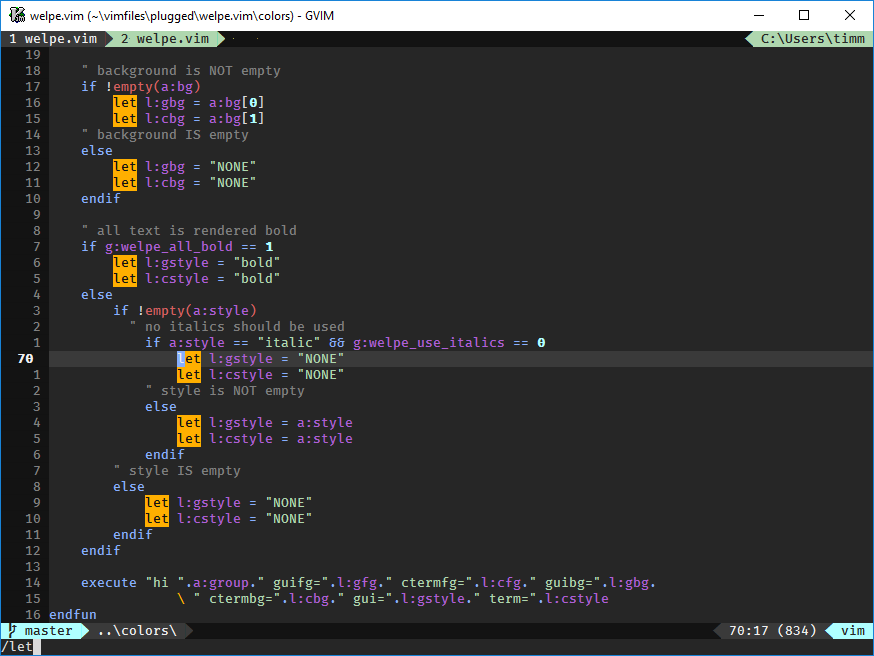
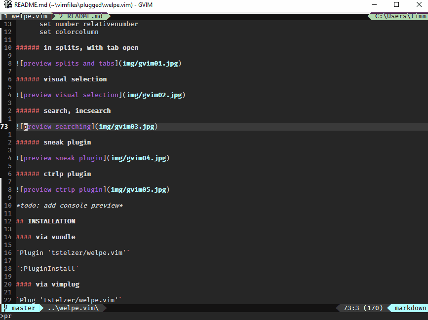
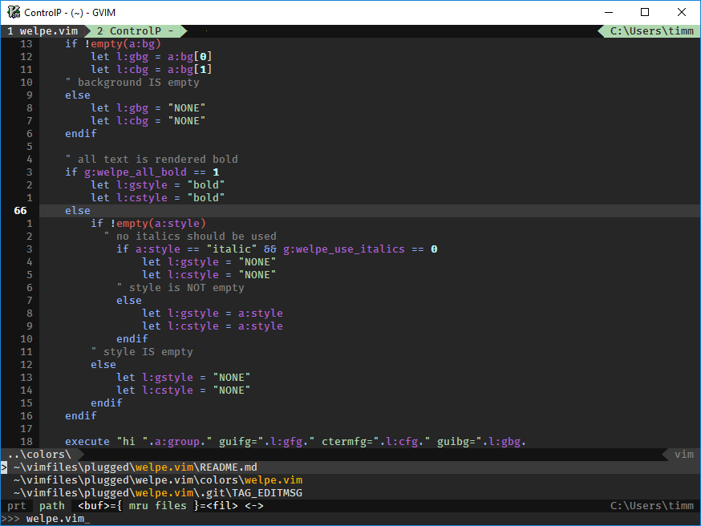

WELPE.vim 
==========

Dark color scheme for [vim](https://www.vim.org).

PALETTE
-------

 `gray1 #121212 (234)`

 `gray2 #262626 (237)`

 `gray4 #262626 (237)`

 `darkblue #000087 (18)`

 `darkgreen #005f00 (22)`

 `maroon #5f0000 (52)`

 `maya #87afff (111)`

 `pale pink #ff87af (211)`

 `moss #afd7af (151)`

 `pale turquoise #afffff (159)`

 `roman #d75f5f (160)`

 `orange #ffaf00 (214)`

 `shalimar #ffffaf (229)`

 `neutral #808080 (244)`

 `gray21 #dadada (253)`

 `truewhite #ffffff (15)`

PREVIEW
-------

#### win64 gvim +lightline plugin
(off the top of my head) relevant settings: 

      set number relativenumber 
      set cursorline

###### in splits, with tab open

###### visual selection

###### search, incsearch

###### sneak plugin

###### ctrlp plugin

*todo: add console preview*

INSTALLATION
------------

#### via vundle

`Plugin 'tstelzer/welpe.vim'`

`:PluginInstall`

#### via vimplug

`Plug 'tstelzer/welpe.vim'`

`:PlugInstall`

#### manual download

- place [tstelzer/welpe.vim/master/colors/welpe.vim](https://raw.githubusercontent.com/tstelzer/welpe.vim/master/colors/welpe.vim) in `~/<yourvimdir>/colors/`

#### enable colorscheme

add the following line *after* `:syntax enable`

`colorscheme welpe`

TESTED PLUGINS
--------------

*legend*
- [x] **tested || works well**
- [ ] **to-be-tested || awful**

*unlisted plugins might very well still work, depending on what highlight groups
they are using; the listed are simply the ones that I have tested and / or
modified*

- [x] [GitGutter](https://github.com/airblade/vim-gitgutter)
- [x] Diffs: finally readable, see screenshots
- [x] [vim-sneak](https://github.com/justinmk/vim-sneak) colors consistent with
search, specifically streak-mode and overlay colors
- [x] [incsearch](https://github.com/haya14busa/incsearch.vim) colors consistent
with search
- [x] [syntastic](https://github.com/scrooloose/syntastic) made the inline-error
messages less obnoxious
- [x] [dirvish](https://github.com/justinmk/vim-dirvish) 
- [ ] [ctrlp](https://github.com/ctrlpvim/ctrlp.vim) would still prefer more
color, to differentiate folder, file and file type

#### note on lightline support

I have removed the lightline config for the following reasons:

- It is a very specific implementation of a statusline, other plugins get left out
so I would rather not support any than all of them.
- I stopped using it myself, so updates would be half-arsed and infrequent.
- The additional files in the repo could lead to confusion. This is a colorscheme and 
should only consist of the colorscheme file itself.

On the same note, if you are interested in making your own statusline without using any
plugin dependencies, check out [this blog post](http://got-ravings.blogspot.de/2008/08/vim-pr0n-making-statuslines-that-own.html).

TESTED FILETYPES
----------------

*legend*
- [x] **tested** and/or **works well**
- [ ] **to-be-tested** and/or **awful**

*unlisted filetypes might very well still work, depending on what highlight groups
they are using; the listed are simply the ones that I have tested and / or
modified*

**Important:** The effect of color schemes is depending on the runtime files *you* are using. If colors are flawed,
chances are, you are using "bad" runtime files, many defaults are not up-to-date.

- [x] HTML (recommended: [othree/html5.vim](https://github.com/othree/html5.vim))
- [x] PHP
- [x] CSS (recommended: [JulesWang/css.vim](https://github.com/JulesWang/css.vim) and [hail2u/vim-css3-syntax](https://github.com/hail2u/vim-css3-syntax))
- [x] SCSS (recommended: [cakebaker/scss-syntax.vim](https://github.com/cakebaker/scss-syntax.vim))
- [x] JavaScript (recommended: [pangloss/vim-javascript](https://github.com/pangloss/vim-javascript))
- [x] Markdown
- [ ] Pug (formerly Jade)
  [ ] Python
  [ ] Pandoc-things

NEXT UP
-------

* fixing python and pandoc
* everything error/warning

CHANGELOG
---------

v0.2.1

    lighten the darkbg color
    lighten the lightfg color

    remove statusline usergroups
    colorize statusline with moss green

    make error messages more prevalent

    differentiate search from incsearch

    various smaller fixes

v0.2.0

    add markdown support

    modify javascript

    de-emphasizing delimiters

    remove italic styling entirely
    remove all-bold option
    remove lightline support

    add statusline usercolor option

    heat up by swapping out mediumorchid (rich purple) for palepink (hot & pale
    pink)

    use roman (lightred) for Identifiers

    simplify colorscheme file

v0.1.2

    add consistent colors for dirvish, syntastic, incsearch

    various cleanups, some miniscule changes

v0.1.1

    add readable diff colors
